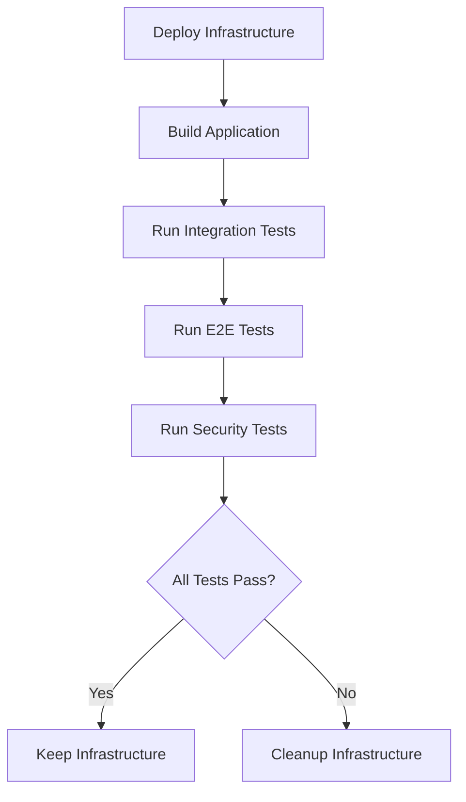

# Integration Testing Guide

This directory contains comprehensive integration tests for the File Sharing App, including AWS integration, end-to-end workflows, and security validation.

## Test Structure

```
test/
├── config/                 # Test configuration utilities
│   └── test_config.go     # Configuration loading and validation
├── integration/           # AWS integration tests
│   └── aws_integration_test.go
├── e2e/                   # End-to-end workflow tests
│   └── end_to_end_test.go
├── security/              # Security validation tests
│   └── security_validation_test.go
├── run_integration_tests.sh  # Test runner script
└── README.md              # This file
```

## Prerequisites

### 1. AWS Infrastructure

Before running integration tests, you need to deploy the AWS infrastructure:

```bash
# Deploy development infrastructure
make deploy-dev

# Or deploy manually
cd infrastructure
./scripts/deploy.sh us-west-2
```

### 2. Environment Variables

Set the following environment variables (these are automatically set by GitHub Actions):

```bash
export S3_BUCKET="your-test-bucket-name"
export AWS_REGION="us-west-2"
export AWS_ACCESS_KEY_ID="your-access-key"
export AWS_SECRET_ACCESS_KEY="your-secret-key"
```

### 3. AWS CLI (Optional)

Install AWS CLI for credential verification:

```bash
# Verify credentials work
aws sts get-caller-identity
```

## Running Tests

### All Integration Tests

```bash
# Using the test runner script (recommended)
./test/run_integration_tests.sh

# Or using Make
make test-integration
```

### Individual Test Suites

```bash
# AWS integration tests only
make test-aws
go test -v -tags=integration ./test/integration/...

# End-to-end tests only
make test-e2e
go test -v -tags=e2e ./test/e2e/...

# Security tests only
make test-security
go test -v -tags=security ./test/security/...
```

### Running Tests in Short Mode

```bash
# Skip integration tests (runs unit tests only)
go test -short ./...
```

## Test Categories

### 1. AWS Integration Tests (`test/integration/`)

Tests core AWS functionality:

- **S3 Service Integration**
  - File upload with progress tracking
  - Presigned URL generation
  - File deletion and cleanup
  - Large file handling with chunking
  - Multiple file operations
  - Error handling scenarios

- **Credential Management**
  - Secure credential storage
  - Credential validation
  - Credential retrieval

**Key Test Cases:**
- File upload and download workflow
- Large file upload (10MB) with chunking
- Multiple file operations (5 files)
- Error handling for invalid operations

### 2. End-to-End Tests (`test/e2e/`)

Tests complete user workflows:

- **Complete File Sharing Workflow**
  - File upload → sharing → recipient access → deletion
  - File metadata management
  - Sharing history tracking

- **File Expiration Workflow**
  - Expiration date setting
  - Automatic expiration detection
  - Cleanup of expired files

- **Application Controller Integration**
  - Controller-level operations
  - Settings management
  - Error handling through controller

**Key Test Cases:**
- Complete user workflow (upload → share → delete)
- File expiration and cleanup
- Multiple files and sharing
- Application controller integration

### 3. Security Tests (`test/security/`)

Tests security aspects:

- **Credential Security**
  - Secure storage validation
  - No plain-text credential exposure
  - Database file permissions

- **Presigned URL Security**
  - URL structure validation
  - HTTPS enforcement
  - Expiration limits (max 7 days)
  - Signature validation

- **S3 Bucket Security**
  - Public access prevention
  - Server-side encryption
  - Object tagging for lifecycle

- **Error Handling Security**
  - No sensitive data in error messages
  - File path validation
  - Input sanitization

**Key Test Cases:**
- Presigned URL structure and security
- Credential storage security
- S3 bucket access control
- Error message security

## Test Configuration

### Environment Variables

| Variable | Required | Default | Description |
|----------|----------|---------|-------------|
| `S3_BUCKET` | Yes | - | S3 bucket name for testing |
| `AWS_REGION` | Yes | - | AWS region |
| `AWS_ACCESS_KEY_ID` | Yes | - | AWS access key |
| `AWS_SECRET_ACCESS_KEY` | Yes | - | AWS secret key |
| `TEST_TIMEOUT` | No | 30m | Test timeout duration |
| `MAX_FILE_SIZE` | No | 100MB | Maximum test file size |
| `TEST_FILE_PREFIX` | No | integration-test | Prefix for test objects |
| `CLEANUP_AFTER_TESTS` | No | true | Clean up test objects |

### Test Configuration File

The `test/config/test_config.go` file provides:

- Environment variable loading
- Configuration validation
- Default value management
- Test key prefix generation

## GitHub Actions Integration

### Automated Testing

The `.github/workflows/deploy.yml` workflow:

1. **Validates** CloudFormation templates
2. **Deploys** AWS infrastructure
3. **Builds** the application
4. **Runs** all integration test suites
5. **Cleans up** resources on failure (dev environment)

### Workflow Triggers

- **Push to main**: Runs full deployment and testing
- **Pull requests**: Validates infrastructure changes
- **Manual dispatch**: Allows environment/region selection

### Test Execution Flow



## Test Data Management

### Test Object Naming

Test objects use the following naming convention:
```
{TEST_FILE_PREFIX}/{timestamp}/{test-specific-suffix}
```

Example: `integration-test/1640995200/upload-test-12345`

### Cleanup Strategy

- **Automatic cleanup**: Test objects are deleted after each test
- **Prefix isolation**: All test objects use unique prefixes
- **Lifecycle policies**: S3 lifecycle rules clean up any missed objects
- **Failed test cleanup**: GitHub Actions cleans up on test failures

## Troubleshooting

### Common Issues

1. **Missing Environment Variables**
   ```
   Error: missing required environment variables: [S3_BUCKET, AWS_REGION]
   ```
   **Solution**: Set all required environment variables

2. **AWS Credential Issues**
   ```
   Error: AWS credentials are not valid
   ```
   **Solution**: Verify credentials with `aws sts get-caller-identity`

3. **S3 Bucket Access Denied**
   ```
   Error: AccessDenied: Access Denied
   ```
   **Solution**: Check IAM permissions and bucket policies

4. **Test Timeouts**
   ```
   Error: test timed out after 30m0s
   ```
   **Solution**: Increase `TEST_TIMEOUT` or check network connectivity

### Debug Information

Enable verbose logging:
```bash
# Run with verbose output
go test -v -tags=integration ./test/integration/...

# Run specific test
go test -v -tags=integration -run TestAWSIntegration ./test/integration/...
```

### Test Isolation

Each test run uses:
- Unique object key prefixes
- Temporary local databases
- Isolated credential storage
- Separate test configurations

## Performance Considerations

### Test Execution Time

Typical execution times:
- **Integration tests**: 2-5 minutes
- **E2E tests**: 3-7 minutes  
- **Security tests**: 1-3 minutes
- **Total**: 6-15 minutes

### Resource Usage

- **S3 operations**: ~50-100 API calls per full test run
- **Test objects**: 10-20 objects created/deleted
- **Data transfer**: ~50-100MB total
- **Local storage**: Temporary files cleaned up automatically

### Optimization Tips

1. **Run specific test suites** when debugging
2. **Use test prefixes** to isolate test runs
3. **Enable cleanup** to avoid resource accumulation
4. **Monitor AWS costs** for frequent test runs

## Contributing

### Adding New Tests

1. **Choose appropriate test category** (integration/e2e/security)
2. **Use test configuration** from `test/config`
3. **Follow naming conventions** for test objects
4. **Include cleanup logic** in test teardown
5. **Add build tags** (`//go:build integration`)

### Test Guidelines

- **Use real AWS services** instead of mocking when possible
- **Test error conditions** as well as success paths
- **Include security validations** in all tests
- **Use unique test data** to avoid conflicts
- **Clean up resources** after tests complete

### Example Test Structure

```go
//go:build integration

func TestNewFeature(t *testing.T) {
    if testing.Short() {
        t.Skip("Skipping integration test in short mode")
    }
    
    // Load test configuration
    testConfig, err := config.LoadTestConfig()
    require.NoError(t, err)
    
    // Setup test environment
    // ... test setup code ...
    
    t.Run("Test Case Name", func(t *testing.T) {
        // Test implementation
        // ... test code ...
        
        // Cleanup
        defer cleanup()
    })
}
```